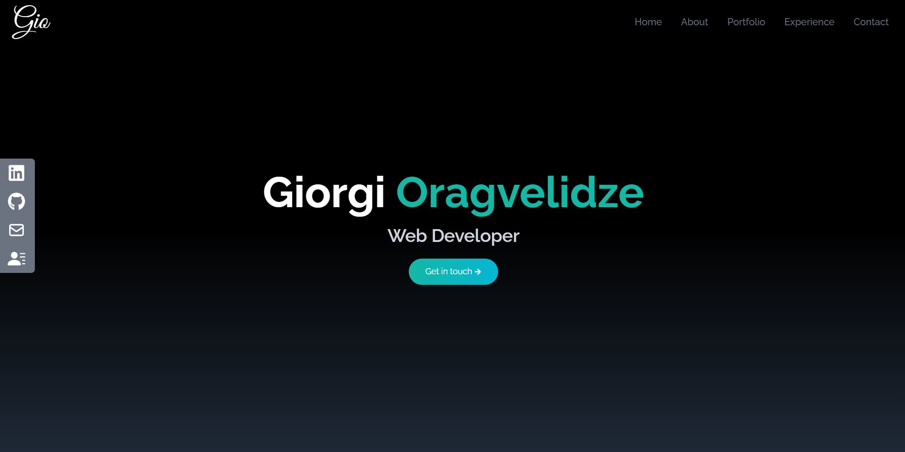

# Personal Portfolio Website

## Description

Welcome to my simple and effective Personal Portfolio Website, built using React and styled with Tailwind CSS. This project serves as a showcase of my journey as a beginner React developer, allowing me to hone my React skills and dive deep into the world of Tailwind CSS.

### Project Goals

My primary goal for this project was to enhance my proficiency in React while also gaining hands-on experience with Tailwind CSS. The result is a sleek and minimalistic portfolio that reflects my design sensibilities.

## Features

- Utilization of React.js for creating interactive and dynamic user interfaces
- Tailwind CSS for a visually appealing and responsive design
- Incorporation of `useState` hook for efficient state management
- Implementation of `map` functions to render dynamic content

## Getting Started

Follow these steps to explore my Personal Portfolio Website on your local machine:

1. Clone this repository: `git clone https://github.com/drstrangelove193/personal-portfolio-react-tailwind.git`
2. Navigate to the project directory: `cd portfolio-project`
3. Install dependencies: `npm install`
4. Run the development server: `npm start`

## Usage

Explore my Personal Portfolio Website to:

- Learn about my skills, background, and projects
- Witness the seamless interaction between React components
- Experience the elegant and minimalistic design

## Acknowledgments

This project has been a valuable learning experience as I navigate my journey in web development. Special thanks to the React community and the creators of Tailwind CSS for their fantastic tools.

For any inquiries or feedback, please feel free to reach out to me at giorgioragvelidze1@gmail.com

